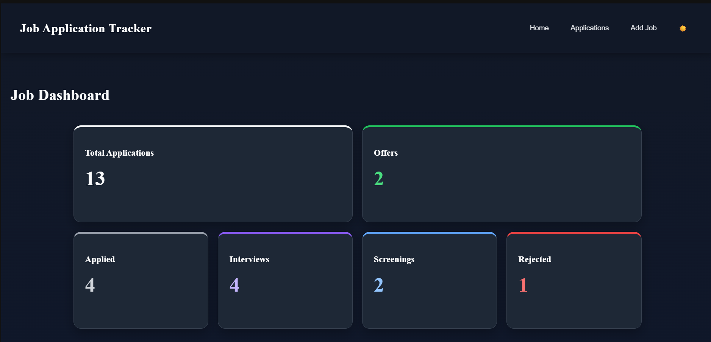
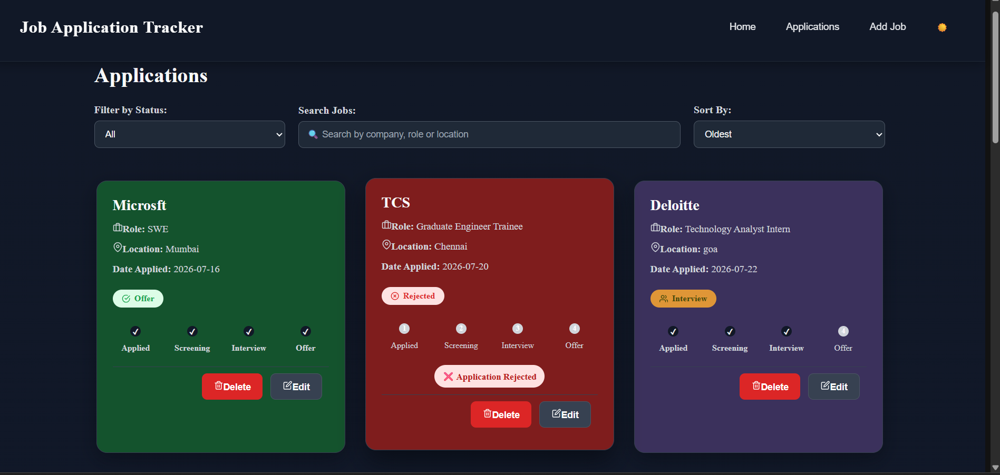
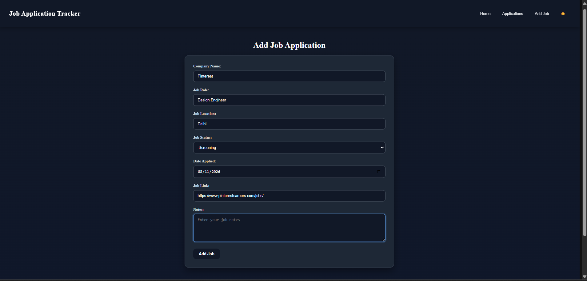

# Job Application Tracker

A responsive React application for tracking and managing job applications in one place.

The application allows users to add, edit, delete, search, filter, and sort job applications while tracking their application status and progress.

## 🚀 Features

* Add new job applications
* Edit existing applications
* Delete applications
* Search applications by:

  * Company
  * Job role
  * Location
* Filter applications by status
* Sort applications by:

  * Newest
  * Oldest
  * Company A-Z
  * Company Z-A
* View detailed information about each application
* Track application progress
* Dashboard with application statistics
* Persist application data using `localStorage`
* Form validation for required fields
* Empty states for situations with no applications or matching results
* Handling for missing job applications
* Handling for missing job links
* Responsive design for desktop and mobile devices
* Dark and light mode

## 🛠️ Tech Stack

* **React** — UI development
* **Vite** — Development and build tool
* **JavaScript** — Application logic
* **React Router** — Client-side routing
* **CSS** — Styling and responsive layouts
* **localStorage** — Client-side data persistence

## 📸 Screenshots

### Dashboard



### Applications



### Add Job



### Job Details


## 📂 Project Structure

```text
src/
├── components/
│   ├── JobCard.jsx
│   ├── Navbar.jsx
│   ├── StatusBadge.jsx
│   └── StatusProgress.jsx
│
├── pages/
│   ├── Home.jsx
│   ├── Applications.jsx
│   ├── AddJob.jsx
│   └── JobDetails.jsx
│
├── App.jsx
├── main.jsx
└── ...
```

## ⚙️ Installation

Clone the repository:

```bash
git clone https://github.com/tejeswi-ni/job-application-tracker-react-.git
```

Navigate into the project:

```bash
cd job-tracker
```

Install dependencies:

```bash
npm install
```

## ▶️ Running the Project

Start the development server:

```bash
npm run dev
```

Open the local development URL shown in the terminal, usually:

```text
http://localhost:5173
```

## 💾 Data Persistence

Job application data is stored in the browser using `localStorage`.

This means applications remain available after refreshing the page or restarting the development server.

The data is stored locally in the user's browser and is not connected to a backend database.

## 🎯 Project Goals

This project was built to practice and demonstrate:

* React component development
* State management with React Hooks
* Form handling and validation
* Conditional rendering
* React Router
* CRUD operations
* Searching, filtering, and sorting
* Browser `localStorage`
* Responsive UI design
* Handling real-world empty and error states

## 🔮 Future Improvements

Possible future improvements include:

* Backend database integration
* User authentication
* Cloud data synchronization
* Application deadline reminders
* Advanced analytics
* Export applications to CSV
* Pagination for large application lists

## 👩‍💻 Author

**Tejeswini**

Built as a React project to practice frontend development and build a practical application for managing job applications.
